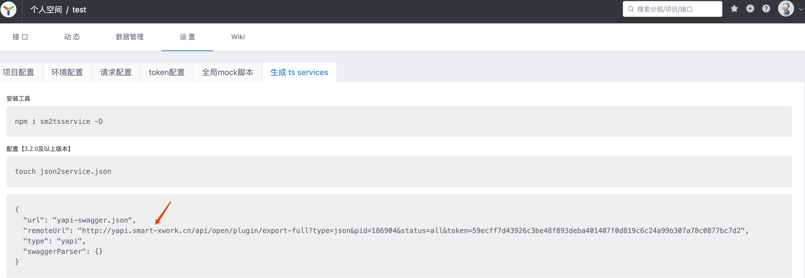

---
nav:
  title: Api-gen
  path: /api-gen
  order: 3
group:
  title: usage
  path: /usage
  order: 1
---

# API 代码生成
## install 
```
npm install @clean-js/api-gen
```
## 功能
 - 根据YAPI，swagger2，swagger3等api协议自动生成请求代码
 - 声明完整的Typescript入参和出参类型 
 - YAPI会在注释中写入该接口的地址
 - 方法命名规则为 method+url；如/user，method：post，生成的代码如下
    ```typescript
        /** Yapi link: https://yapi.xxx.com/project/2055/interface/api/125352 */
    export function postUser(parameter: { body: PostUserBody }) {
      return Req.request<ResponsePostUser>({
        url: '/user',
        method: 'post',
        data: parameter.body,
      });
    }
    ```
## config 
interface
```typescript
export interface Config {
  url: string; // http或者文件绝对路径
  outDir?: string; // 输出文件路径，默认为./clean-js
  type?: "umi3" | "axios"; // 生成的代码类型，umi3是基于umi-request请求库,  默认为 axios
}
```
新建clean.config.ts
```typescript
export default {
  url: 'https://petstore3.swagger.io/api/v3/openapi.json', // swagger 3
  url: 'https://petstore.swagger.io/v2/swagger.json', // swagger 2
  url: 'http://yapi.smart-xwork.cn/api/open/plugin/export-full?type=json&pid=186904&status=all&token=59ecff7d43926c3be48f893deba401407f0d819c6c24a99b307a78c0877bc7d2' // yapi
}
```
## YAPI
1. 项目->设置->生成 ts services 
2. 复制remoteUrl地址
3. 在clean.config.ts文件中填入url地址
4. 运行npm run api-gen

## Swagger
1. 复制swagger json在线地址，或者本地文件绝对地址（相对地址）
2. 在clean.config.ts文件中填入url地址
3. 运行npm run api-gen


## 运行时

在代码运行时设置请求实例
```typescript
import { Req } from '@/clean-js/http.service';
function initCleanJsApi() {
  Req.set(request);
}
```
