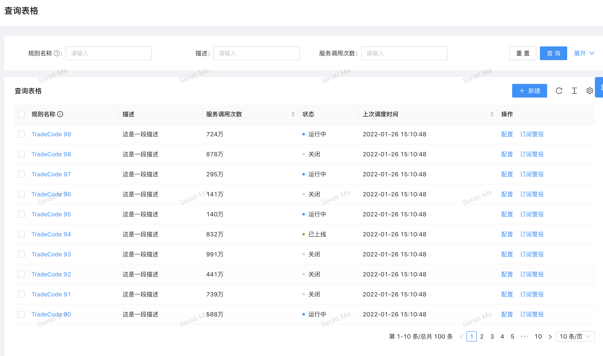

# @routine-js/table

## 场景
需要实现下面的表单页面，有筛选，分页等功能


## usage 
### example

<code src="../demos/table/index.tsx"></code>
#### Full example
<!-- <code src="../demos/table/antdTable.tsx"></code> -->

1.实现获取表单数据的服务

### 泛型描述
| 参数       | 说明                                             | 类型 | 默认值 |
| ---------- | ------------------------------------------------ | ---- | ------ |
| Row | 每一行的数据格式 | any   |        |
| Params  | 表单的请求参数               |Partial\<Params\> & { current: number; pageSize: number }   |        |

### 
| 参数       | 说明                                             | 类型 | 默认值 |
| ---------- | ------------------------------------------------ | ---- | ------ |
| fetchTable | 实际拉取表单数据的方法 | (params: Partial\<Params\> & { current: number; pageSize: number }, ): Promise\<{   data: Row[];   current: number;   pageSize: number;   total: number; }\>   |        |

```typescript
// 每一行的数据格式，自己定义
interface Row {
  name: string;
}
// 表单的请求参数 自己定义
interface Params {
  name: string;
}
class MyService extends AbsTableService<Row, Params> {
  fetchTable(
    params: Partial<Params> & { current: number; pageSize: number },
  ): Promise<{
    data: Row[];
    current: number;
    pageSize: number;
    total: number;
  }> {
    const res = {
      data: [{ name: 'aloha' }],
      current: 1,
      pageSize: 1,
      total: 1,
    };
    return new Promise((resolve) => {
      setTimeout(() => {
        resolve(res);
      }, 1000);
    });
  }
}
```

2. 注入服务
```typescript
const Page = () => {
  const { presenter } = usePresenter<TablePresenter<Row, Params>>(
    TablePresenter,
    {
      registry: [{ token: TableServiceToken, useClass: MyService }],
    },
  );
  return (
    <div>
      <h1>table state</h1>
      <p>{JSON.stringify(presenter.state, null, 4)}</p>

      <button
        onClick={() => {
          presenter.getTable();
        }}
      >
        fetch table
      </button>
    </div>
  );
};
```
## api

| 参数       | 说明                                             | 类型 | 默认值 |
| ---------- | ------------------------------------------------ | ---- | ------ |
| presenter.showLoading | 设置loading 为true   |     |        |
| presenter.hideLoading  | 设置loading 为false                |   |        |
| presenter.updateTablePagination  | 设置分页数据                |   |        |
| presenter.getTable  | 调用服务拉取表单数据                |   |        |
| presenter.updateTableParams  | 设置请求的参数                |   |        |
| presenter.resetTableParams  | 重置请求的参数                |   |        |
| presenter.state  | 数据模型，如下                |   |        |


state
```typescript
interface IViewState<Row, OtherParams> {
  loading: boolean;
  // 请求表格的数据
  table: {
    data: Row[];
    params: OtherParams; // 额外参数
    pagination: {
      current: number;
      pageSize: number;
      total: number;
    };
  };
}
```
