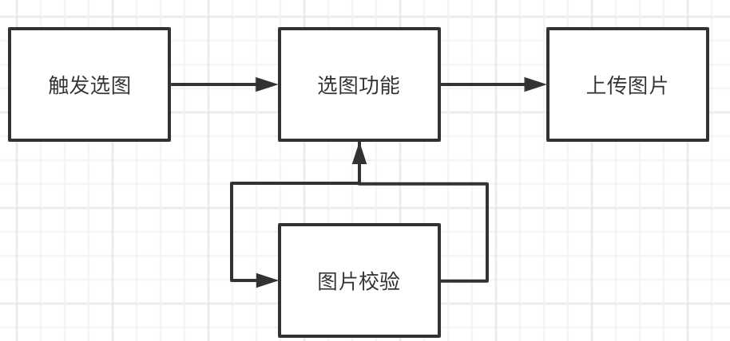
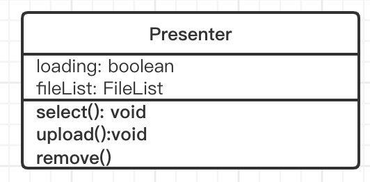
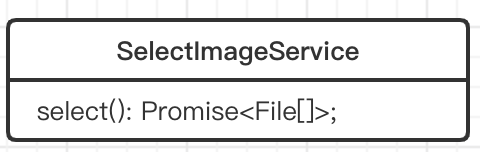
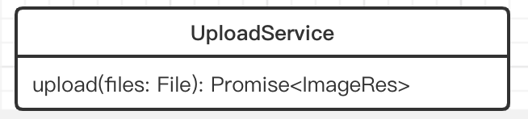

---
nav:
  title: Ecosystem
  path: /ecosystem
  order: 4
---

# @routine-js/upload-image

业务场景：
- 需求A: 管理后台需要上传一张图片，限制大小为5m，传到oss，获取返回的信息，把返回信息保存到服务端
- 需求B：小程序需要上传一张图片，限制大小为5m，传到oss，获取返回的信息，把返回信息保存到服务端
- 需求C：App里的H5需要上传一张图片，限制大小为2m, 宽高100px，传到七牛云，获取返回的信息，把返回信息保存到服务端
- 需求D: ...
  
从上面的场景看来，这些需求都是大同小异，整体流程基本没变，可以抽象成下图

 
 

根据这个流程图，可以得出Presenter的接口,如下

 

接着把选图功能做成一个接口



接着把上传功能做成一个接口  




当我们需要切换功能的时候，替换具体实现即可,基于上面的流程抽象出一个选图上传业务组件，使用如下  


## install

```
yarn install @routine-js/upload-image
```

```
npm install @routine-js/upload-image --save
```

## usage

### API
### example

<code src="../demos/upload-image/index.tsx"></code>
### Select Service
1. 实现选图服务，实现Select方法即可，这里可以使用库提供的方法
2. 使用中间件；可以在这里实现判断大小，尺寸等逻辑，这个库也有默认提供的方法

| 参数       | 说明                                             | 类型 | 默认值 |
| ---------- | ------------------------------------------------ | ---- | ------ |
| AbsSelectImageService.select | 具体的上传方法，需要用户自己实现 |   upload(): Promise\<File[])\>   |        |
| AbsSelectImageService.useMiddleware(middleware: IMiddleware<File[]>): void  | 使用中间件，在这里可以添加对图片处理的中间件，比如校验大小..                 |   |        |


```typescript
import {
  AbsUploadService,
} from '@routine-js/upload-image';

export class MySelectImageService extends AbsSelectImageService {
  select() {
    // 返回你选好的图片，在这里实现browser input, jsbridge等等你需要的方法
    return Promise.resolve([file])
  };
}
```
#### 浏览器选图
##### interface
```typescript
SelectFnFactor.buildBrowserInputSelect(option?: BrowserInputSelect | undefined): () => Promise<File[]>
```
浏览器 input 选择服务
```typescript
/**
 * 浏览器 input 选择服务
 */
const browserInputSelect: ISelect = SelectFnFactor.buildBrowserInputSelect({
  accept: 'image/*',
});
export class SelectImageServiceBrowserInput extends AbsSelectImageService {
  select = () => browserInputSelect();
}
```
#### 微信选图
todo
#### 选图中间件
```typescript
export class MySelectImageService extends AbsSelectImageService {
  constructor() {
    super();
    // 选图中间件，检查图片大小
    this.useMiddleware(
      SelectImageMiddlewareFactor.checkSize({ max: 100 * 1024 }),
    ); // 限制最大为100k
  }

  select() {
    // 自定义选图功能， 使用浏览器的input来选择图片
    const browserInputSelect = SelectFnFactor.buildBrowserInputSelect({
      accept: 'image/*',
    });
    return browserInputSelect();
  }
}
```
##### 已提供的中间件
校验图片体积大小
```typescript
(method) SelectImageMiddlewareFactor.checkSize(options: {
    max: number;
}): IMiddleware<File[]>
校验图片体积大小

@param options.max — Byte
```
在浏览器校验图片 宽高， 宽高比例
```typescript
(method) SelectImageMiddlewareFactor.checkImageInBrowser(options: {
    width?: number;
    height?: number;
    aspectRatio?: number;
}): IMiddleware<File[]>
校验图片 宽高， 宽高比例
```
todo: 浏览器压缩图片

### Upload Service

1. 先实现上传服务，实现upload方法即可，这里你可以用OSS，七牛云...甚至上传到自己的服务器

| 参数       | 说明                                             | 类型 | 默认值 |
| ---------- | ------------------------------------------------ | ---- | ------ |
| AbsUploadService.upload | 具体的上传方法，需要用户自己实现 |   upload(files: File): Promise\<ImageRes\>   |        |
| ImageRes  | 需要你返回的参数                 | { name: string; url: string; thumbUrl: string; [p: string]: any;}   |        |


```typescript
import {
  AbsUploadService,
} from '@routine-js/upload-image';

class MyUploadService extends AbsUploadService {
  upload(file) {
    // 这里我们模拟一个上传的流程
    return Promise.resolve({
      url: 'xxxurl',
      name: 'xxx.png',
      thumbUrl: 'xxx',
    });
  }
}
```
#### 提供默认的上传服务
todo
- 上传到oss
- 上传七牛云


